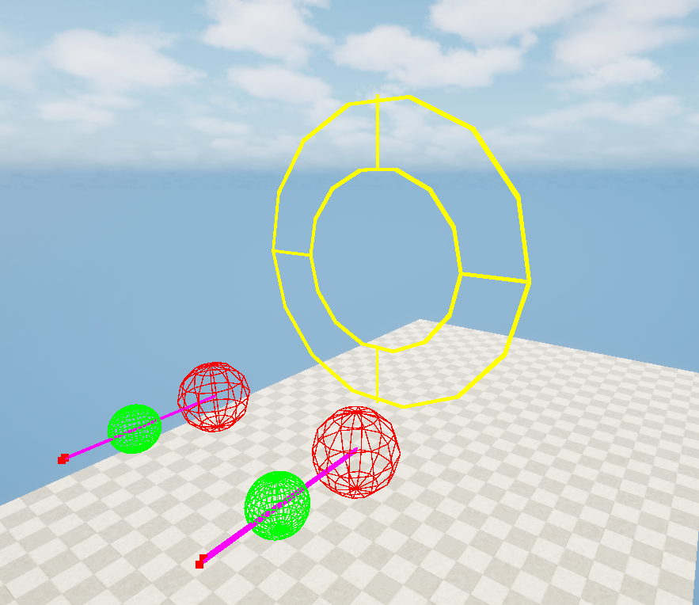
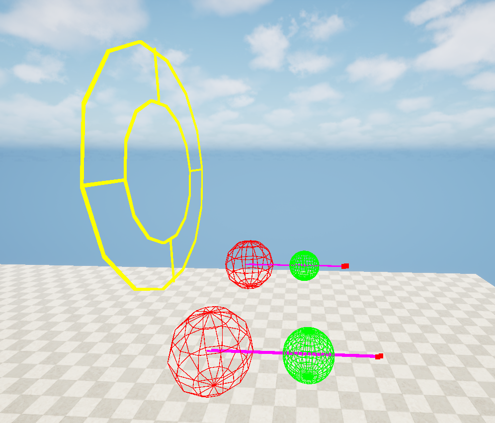
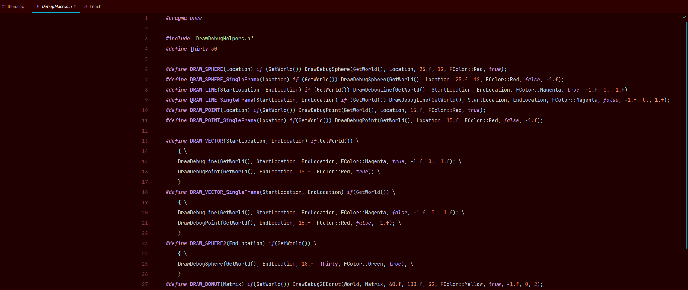

# Unreal Engine 5 - Section 5 Debug Macros Challenge

This project was created as part of the Section 5 Debug Macros module in an Unreal Engine 5 course.

The challenge focused on creating custom debug macros and using Unreal Engine's debug drawing functions to visualize actor locations, directions, and shapes.

---

## Skills & Tools Used

* Creating custom C++ debug macros
* `DrawDebugSphere`
* `DrawDebug2DDonut`
* Working with `FVector`
* `GetActorLocation()`
* `GetActorForwardVector()`
* Vector offsets
* Working with `FMatrix`
* `FMatrix::Identity`
* `SetOrigin()`

---

## Challenge & Outcome

Created a custom debug sphere macro that draws a green sphere 60 Unreal units forward from the actor.

Also experimented with `DrawDebug2DDonut` using an `FMatrix` and set the donut's origin to `(0, 0, 200)`.

### Custom Debug Macros

```cpp
#define DRAW_SPHERE2(EndLocation) if(GetWorld()) \
{ \
    DrawDebugSphere(GetWorld(), EndLocation, 15.f, Thirty, FColor::Green, true); \
}

#define DRAW_DONUT(Matrix) if(GetWorld()) \
    DrawDebug2DDonut(World, Matrix, 60.f, 100.f, 32, FColor::Yellow, true, -1.f, 0, 2);
```

---

## Example

```cpp
FVector Location = GetActorLocation();
FVector Forward = GetActorForwardVector();

DRAW_SPHERE2(Location + Forward * 60.f);

FMatrix Matrix = FMatrix::Identity;
Matrix.SetOrigin(FVector(0.f, 0.f, 200.f));

DRAW_DONUT(Matrix);
```

---

## Screenshots

### Debug Visualization





### C++ Code



---

## Files

* `DebugMacros.h` — Custom debug drawing macros
* `Item.cpp` — Section 5 challenge implementation

---

## Summary

This project demonstrates the use of custom debug macros and Unreal Engine's debug drawing functions to visualize actor locations, directions, and shapes in the viewport.
